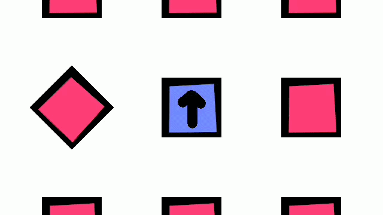
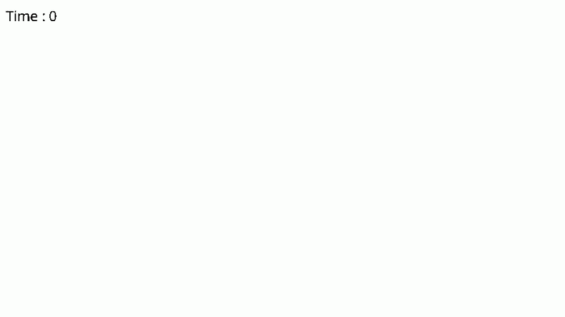

# A2Engine: 基于 C++/Lua 的高性能 2D 跨语言游戏引擎
A2Engine 是一款采用 组件化架构 (Component-Based Architecture) 开发的工业级 2D 游戏引擎。本项目旨在通过 C++ 内核 保证底层执行效率，利用 Lua 脚本托管 实现业务逻辑解耦，并针对大规模计算场景引入了 面向数据设计 (Data-Oriented Design) 优化。

## 🚀 技术核心亮点 (Technical Highlights)
1. 高性能脚本托管与热逻辑解耦 (Language Hosting)
核心实现： 构建了基于 Lua 的脚本运行时环境，实现了引擎内核与游戏逻辑的完全分离。

双语言协同机制：基于 LuaBridge 或底层 API 实现了 C++ 与 Lua 的双向绑定。引擎负责渲染、物理等密集计算，Lua 负责 Actor 的生命周期逻辑（OnStart, OnUpdate）。

动态属性注入系统：支持通过 JSON 配置文件在运行时覆盖 Lua 组件的成员变量，实现了“无需重新编译即可调整游戏数值”的高效开发流。

异常隔离设计：在 C++ 层封装了脚本调用异常捕获（pcall 机制），确保脚本层逻辑错误不会导致引擎主进程崩溃，大幅提升了开发调试的健壮性。

🎥 演示视频：Lua 脚本逻辑实时交互

2. 工业级物理中间件深度集成 (Physics Middleware)
核心实现： 深度集成了 Box2D 物理引擎，将其复杂的约束求解器转化为引擎内置的组件系统。

C++/Lua 混合组件架构：实现了原生的 Rigidbody 和 Collider C++ 组件，并将其 API 暴露给脚本层，平衡了物理更新的高频需求与逻辑开发的易用性。

碰撞过滤优化 (Filtering & Masking)：利用 categoryBits 与 maskBits 实现了精细化的物理碰撞过滤系统，有效减少了无效的碰撞回调（ReportFixture），极大优化了多物体环境下的 CPU 负载。

触发器系统 (Trigger System)：实现了基于回调函数的触发器机制，支持脚本层实时监听物理交互事件。

🎥 演示视频：Box2D 物理环境模拟

3. 面向数据设计 (DOD) 与内存局部性优化
核心实现： 针对粒子系统（Particle System）等高密度计算模块，从传统的 OOP 转向 DOD (Data-Oriented Design) 架构。

缓存友好型布局 (Cache-Friendly)：放弃了“逐对象”存储模式，采用连续内存布局的结构数组（SoA），最大化 空间局部性 (Spatial Locality)，显著降低了 CPU Cache Miss。

SIMD 友好型更新：通过剥离非计算相关的类成员，使得更新循环中仅包含核心计算逻辑，极大地提升了每帧处理数万个活跃粒子的指令吞吐量。

性能飞跃：在同等硬件条件下，相比传统的组件式更新，DOD 架构下的粒子处理能力提升了数倍。

🎥 演示视频：万级粒子系统压力测试

4. 场景管理与序列化系统 (Scene & Serialization)
Actor 模板与继承：支持基于 JSON 的 Actor 模板系统，实现了类似 Unity Prefabs 的预设与属性重写功能。

全局持久化 (DontDestroyOnLoad)：实现了场景切换时的对象持久化机制，确保全局管理组件（如音频管理器、分数追踪）能够跨场景保存状态。

# 🛠️ 技术栈 (Tech Stack)
核心语言: Modern C++ (C++17/20)

脚本语言: Lua (嵌入式托管)

物理引擎: Box2D Middleware

渲染/输入: SDL2 (底层适配)

数据格式: JSON (nlohmann/json) 用于场景描述与序列化

# 🎮 示例作品 (Portfolio)
本引擎已成功支持以下不同类型的 Sample Projects 开发：

《The Whispering Crown》: 侧重于复杂 Lua 脚本逻辑与场景切换。

《Donna the Donut Pilot》: 侧重于输入反馈与动态控制。

《Physics Playground》: 展示了完整的 Box2D 物理特性集成。

# 📬 联系方式 (Contact)
如果您对本引擎的底层实现（如 Lua 绑定机制、DOD 优化细节或物理层集成）感兴趣，欢迎随时沟通。